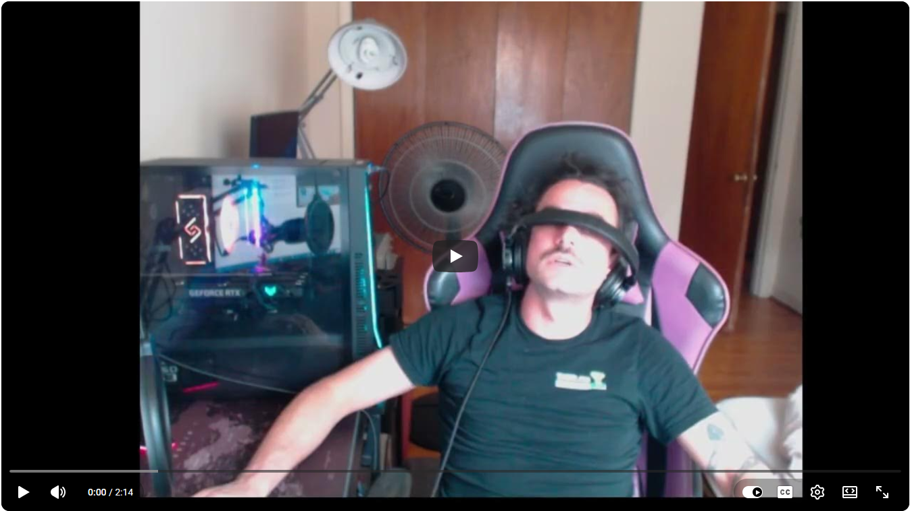

# Aim Lab -> Apex Legends Training Tracker

A weekly-refeed pipeline: keep exporting from Aim Lab, keep running `ingest`,
and the analysis gets more meaningful every week as the dataset grows.

[](https://www.youtube.com/watch?v=oljysAP4u1c)

## Install

You will need python installed on your computer to use `altracker`. To install cleanly, set up a python virtual environment:
```bash
python3 -m venv venv
```

The install all necessary packages using the `requirements.txt`
```bash
venv/bin/python -m pip install -r requirements.txt
```

## Folder contents

- `aimlab_pipeline.py` — the script, run from the command line (needs `pandas`,
  `numpy`, `matplotlib` — `pip install pandas numpy matplotlib` if you don't
  have them).
- `master_aimlab_long.csv` — the growing master dataset. Don't edit by hand;
  `ingest` appends to it automatically and skips sessions it's already seen.
- `apex_sessions.csv` — **fill this in yourself** after your Apex play
  sessions (see below). This is what lets us eventually correlate your
  training with actual in-game performance.
- `report.html` — generated by `report`; open it in a browser.
- `charts/` — trend chart images embedded in the report.

## Weekly routine

1. Play your Aim Lab benchmarks as usual. Export/save the CSVs for that
   session into any folder (e.g. a fresh `new_exports/` folder each week —
   doesn't need to be named anything specific).
2. Run:
   ```
   python aimlab_pipeline.py ingest new_exports/
   ```
   This reads every CSV in that folder and appends any sessions not already
   in `master_aimlab_long.csv`. It's safe to re-run — duplicates are skipped
   automatically (matched on exact timestamp + task).
3. (Optional, but this is the part that ties it back to your actual game)
   Add **one row per Apex match** to `apex_sessions.csv`:
   ```
   date,kills,damage,placement,notes
   2026-08-09,4,650,1,"clean fight at ridgeline"
   2026-08-09,1,220,12,"third-partied early"
   ```
   `placement` is your finishing rank that game (1 = win). Kills, damage,
   and placement are all shown on Apex's own post-match summary screen, so
   no third-party tool is required (note: Apex doesn't track or display an
   overall accuracy stat in-game, which is why it's not part of this log).
   Doesn't need to be every single game — a representative sample each
   week is enough.
4. Run:
   ```
   python aimlab_pipeline.py report
   ```
   and open `report.html`. It's a single self-contained file (charts are
   embedded, no separate image files) — safe to upload anywhere or link
   directly, including for stream overlays.

## What the report shows, and when it becomes useful

- **Per-task trend** — is each drill's score actually going up over time?
  Meaningful after ~4-5 sessions per task.
- **Cross-task correlation** — which drills move together (suggesting shared
  underlying skill) vs. move independently (measuring something distinct).
  Needs at least 3 sessions with overlapping dates across tasks — will
  mostly be blank right now.
- **Leverage ranking** — which task's score best tracks your overall
  performance across everything else. Useful for figuring out which single
  drill is the best "proxy" for your general aim health, so you don't have
  to run all 12 every session to check where you stand.
- **Apex correlation** — once you have 3+ weeks of both logs, this shows
  whether weeks with better Aim Lab scores line up with weeks of better
  Apex results (avg kills, avg damage, avg placement, win rate). This is
  the actual answer to "does this training work" — everything else is a
  proxy for it.
